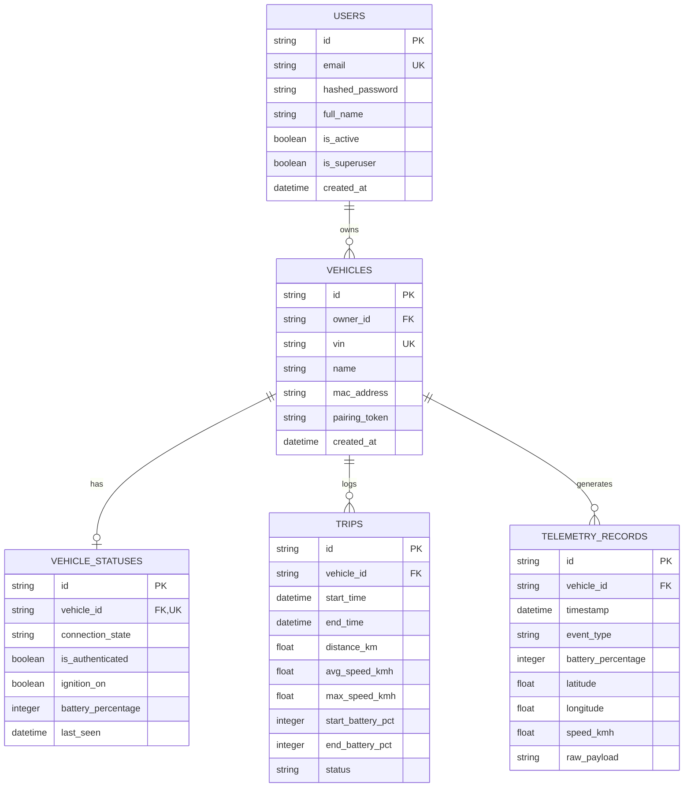

# DATABASE_SCHEMA.md

## `revolt_data` Relational Database Schema Specification

This document provides the complete relational database schema for the `revolt_data` backend service. The database architecture is designed for high-concurrency async operations, strict foreign-key relational integrity, and optimized time-series telemetry persistence.

---

## 1. Entity-Relationship Diagram (ERD)

---

## 2. Table Specifications

### 2.1 `users` Table
Stores user account profiles and credentials.

| Column | Data Type | Nullable | Constraints / Default | Description |
|---|---|---|---|---|
| `id` | `VARCHAR(36)` | No | `PRIMARY KEY` | Unique UUID identifier for user |
| `email` | `VARCHAR(255)` | No | `UNIQUE`, `INDEX` | User email address (login credential) |
| `hashed_password` | `VARCHAR(255)` | No | None | SHA-256 / bcrypt hashed password string |
| `full_name` | `VARCHAR(255)` | No | None | Full legal name of account holder |
| `is_active` | `BOOLEAN` | No | `DEFAULT TRUE` | Account status flag |
| `is_superuser` | `BOOLEAN` | No | `DEFAULT FALSE` | Administrative privilege flag |
| `created_at` | `TIMESTAMP` | No | `DEFAULT UTC_TIMESTAMP` | Account registration timestamp |

---

### 2.2 `vehicles` Table
Stores registered Revolt RV400 motorcycle metadata and hardware credentials.

| Column | Data Type | Nullable | Constraints / Default | Description |
|---|---|---|---|---|
| `id` | `VARCHAR(36)` | No | `PRIMARY KEY` | Unique UUID identifier for vehicle |
| `owner_id` | `VARCHAR(36)` | No | `FOREIGN KEY (users.id)` | User account owning this vehicle |
| `vin` | `VARCHAR(36)` | No | `UNIQUE`, `INDEX` | Vehicle Identification Number |
| `name` | `VARCHAR(100)` | No | `DEFAULT 'RV400'` | User-defined nickname for vehicle |
| `mac_address` | `VARCHAR(17)` | No | None | Hardware BLE MAC address |
| `pairing_token` | `VARCHAR(255)` | No | None | Vehicle secret authentication token |
| `created_at` | `TIMESTAMP` | No | `DEFAULT UTC_TIMESTAMP` | Vehicle registration timestamp |

---

### 2.3 `vehicle_statuses` Table
Stores real-time connectivity, ignition, and battery status for each vehicle.

| Column | Data Type | Nullable | Constraints / Default | Description |
|---|---|---|---|---|
| `id` | `VARCHAR(36)` | No | `PRIMARY KEY` | Unique UUID identifier |
| `vehicle_id` | `VARCHAR(36)` | No | `FOREIGN KEY (vehicles.id)`, `UNIQUE` | One-to-one link to vehicle |
| `connection_state` | `VARCHAR(32)` | No | `DEFAULT 'DISCONNECTED'` | SDK connection state enum name |
| `is_authenticated` | `BOOLEAN` | No | `DEFAULT FALSE` | True if `PAIR` handshake accepted |
| `ignition_on` | `BOOLEAN` | No | `DEFAULT FALSE` | High-voltage powertrain state |
| `battery_percentage` | `INTEGER` | No | `DEFAULT 100` | Current battery charge percentage |
| `last_seen` | `TIMESTAMP` | No | `DEFAULT UTC_TIMESTAMP` | Timestamp of last received BLE frame |

---

### 2.4 `trips` Table
Logs ride history, distance metrics, and battery usage for completed and active trips.

| Column | Data Type | Nullable | Constraints / Default | Description |
|---|---|---|---|---|
| `id` | `VARCHAR(36)` | No | `PRIMARY KEY` | Unique UUID identifier for trip |
| `vehicle_id` | `VARCHAR(36)` | No | `FOREIGN KEY (vehicles.id)`, `INDEX` | Vehicle that logged the trip |
| `start_time` | `TIMESTAMP` | No | `DEFAULT UTC_TIMESTAMP` | Trip commencement timestamp |
| `end_time` | `TIMESTAMP` | Yes | `NULL` | Trip completion timestamp |
| `distance_km` | `FLOAT` | No | `DEFAULT 0.0` | Total trip distance in kilometers |
| `avg_speed_kmh` | `FLOAT` | No | `DEFAULT 0.0` | Average trip speed in km/h |
| `max_speed_kmh` | `FLOAT` | No | `DEFAULT 0.0` | Peak speed recorded during trip |
| `start_battery_pct` | `INTEGER` | No | `DEFAULT 100` | Battery percentage at start of trip |
| `end_battery_pct` | `INTEGER` | No | `DEFAULT 100` | Battery percentage at end of trip |
| `status` | `VARCHAR(32)` | No | `DEFAULT 'IN_PROGRESS'` | Trip state (`IN_PROGRESS`, `COMPLETED`) |

---

### 2.5 `telemetry_records` Table
Time-series table storing decoded telemetry events received from `revolt_ble_toolkit.live`.

| Column | Data Type | Nullable | Constraints / Default | Description |
|---|---|---|---|---|
| `id` | `VARCHAR(36)` | No | `PRIMARY KEY` | Unique UUID identifier for record |
| `vehicle_id` | `VARCHAR(36)` | No | `FOREIGN KEY (vehicles.id)`, `INDEX` | Vehicle generating telemetry |
| `timestamp` | `TIMESTAMP` | No | `DEFAULT UTC_TIMESTAMP`, `INDEX` | Frame capture timestamp |
| `event_type` | `VARCHAR(64)` | No | None | Model event type (`TELEMETRY_FRAME`, `BATTERY_STATUS`, `PAIRING_ACK`) |
| `battery_percentage` | `INTEGER` | Yes | `NULL` | State-of-Charge percentage |
| `latitude` | `FLOAT` | Yes | `NULL` | GPS latitude coordinate |
| `longitude` | `FLOAT` | Yes | `NULL` | GPS longitude coordinate |
| `speed_kmh` | `FLOAT` | Yes | `NULL` | Vehicle speed in km/h |
| `raw_payload` | `TEXT` | No | None | Unmodified string representation of payload |

---

## 3. Indexing & Optimization Strategy

1. **Composite Time-Series Indexing**: `telemetry_records` uses a composite index on `(vehicle_id, timestamp DESC)` to accelerate time-range querying and pagination.
2. **Ride History Queries**: `trips` uses a composite index on `(vehicle_id, start_time DESC)` for rapid ride log retrieval.
3. **Unique Constraints**: Unique indexes on `users.email`, `vehicles.vin`, and `vehicle_statuses.vehicle_id` enforce entity integrity at the database layer.

---
*Generated for `revolt_data` FastAPI Backend Service.*
