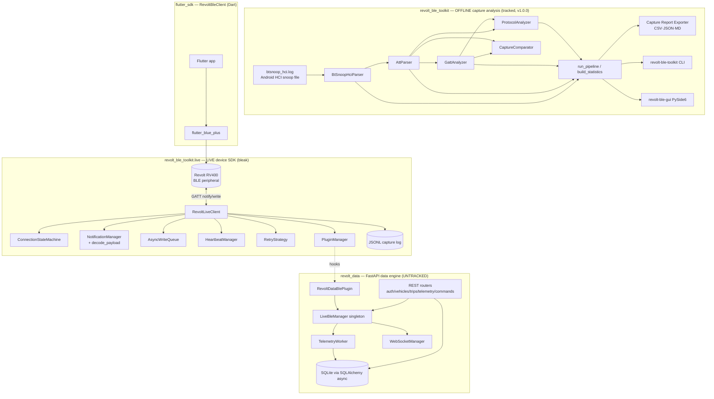
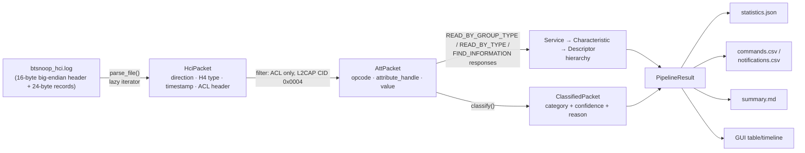
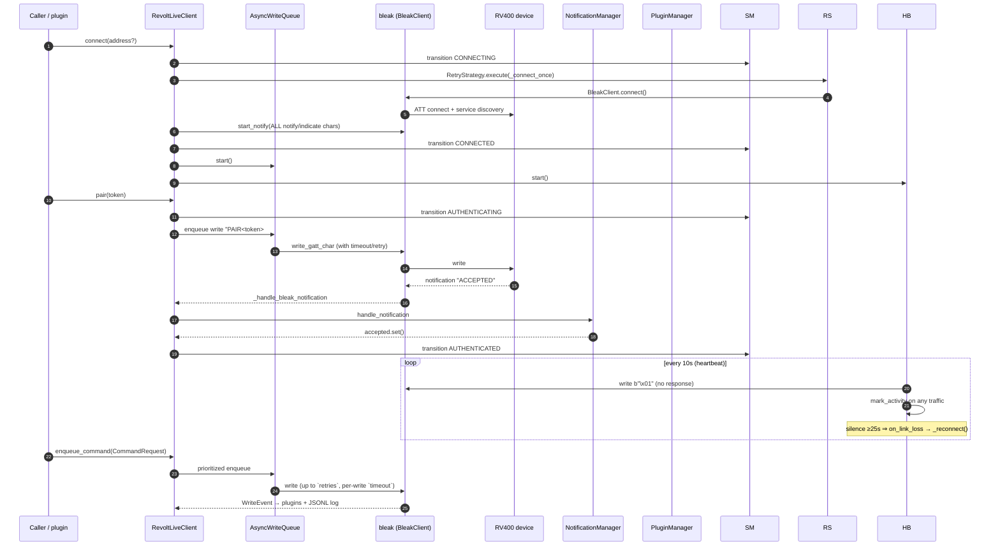

# PROJECT STATE REPORT

**Repository:** `revolt_ble_toolkit` (`C:\Desktop\flutter_projects\revolt_ble_toolkit`)
**Branch audited:** `dev-mann` (local branch, ahead of `main`)
**Audit date:** 2026-08-02
**Audit type:** Read-only, full-repository inspection. No code was modified. All findings verified against source on disk and live tool runs (pytest / ruff / mypy).

> ⚠️ **Important scope note:** This repository currently contains **three distinct products** sharing one working tree:
> 1. **`revolt_ble_toolkit`** (tracked, v1.0.0) — the Python BLE reverse-engineering toolkit.
> 2. **`revolt_data`** (**untracked, new**) — a FastAPI backend + data engine layered on the toolkit.
> 3. **`flutter_sdk` / `revolt_ble_sdk`** (tracked, v0.0.1) — a pure-Dart Flutter BLE client.
>
> Only product 1 is packaged for release. Products 2 and 3 are works-in-progress at very different maturity levels. This report treats the repository as it actually is, not as any single README describes it.

---

# 1. Executive Summary

| Dimension | Assessment |
|---|---|
| **Overall project maturity** | **Toolkit alone: ~92–95%** (stable, well-tested, v1.0.0). **Whole repo as it stands: ~55–60%** — the core is done, but the two new subsystems (`revolt_data`, `flutter_sdk`) are early-stage, and one known security blocker (live secrets in git history) is **unresolved on the remote**. |
| **Project purpose** | Reverse-engineer BLE traffic from **Revolt RV400 electric motorcycles** captured in **Android HCI Snoop logs** (offline analysis), plus a **live BLE client** (Bleak) to talk to the vehicle, plus a **FastAPI data backend** and a **Flutter SDK** to build apps on top. |
| **Current architecture** | Layered Python 3.12 package (parsers → pipeline → analyzers → exporters, plus GUI / CLI / live SDK) + a sibling FastAPI app (`revolt_data`) that consumes the toolkit's live plugin API + a Flutter package wrapping `flutter_blue_plus`. |
| **Overall quality** | **Toolkit: high** — mypy-strict codebase, 92% statement coverage, 170 passing tests, clean Ruff/Black. **`revolt_data`: low-to-medium** — architecturally sensible but has **7 distinct security blockers**, dead code paths, and isn't packaged. **Flutter SDK: medium** — clean public API, but only 4 unit tests and an unpublishable `pubspec`/`LICENSE`. |

**Verified health snapshot (run against this working tree):**

| Check | Result |
|---|---|
| Pytest (toolkit) | ✅ **170 passed** in ~19 s |
| Pytest (`tests/test_revolt_data`) | ✅ **4 passed** (runs standalone; see Known Issues for collection-detail caveat) |
| Statement coverage (`--cov=revolt_ble_toolkit`) | ✅ **92% total**, several modules at 100% |
| Ruff (`check src tests`) | ✅ **All checks passed** |
| Black | ✅ enforced in CI |
| **Mypy `strict = true`** | ❌ **1 error** in `tests/test_live/test_client.py:353` (`comparison-overlap`) |

---

# 2. Folder Structure

Complete, meaningful tree (build/caches/`.git`/flutter generated artifacts omitted):

```
revolt_ble_toolkit/
├── pyproject.toml                  # PEP 621 build config; hatchling; mypy strict; ruff; pytest
├── requirements.txt                # COMMENTS ONLY — runtime deps are intentionally stdlib-empty
├── requirements-dev.txt            # ruff, black, mypy, pytest, pytest-cov
├── VERSION                         # "1.0.0"
├── .python-version                 # "3.12"
├── .gitignore                      # ignores *.log, bugreport*, output/, secrets-bearing captures
├── .gitleaks.toml                  # extends default ruleset; allowlists 6 docs that quote the incident
├── .githooks/pre-commit            # opt-in hook: filename blocks + IMEI/ICCID/PAIR-token regexes + gitleaks
│
├── src/
│   ├── revolt_ble_toolkit/         # ── TRACKED, v1.0.0, 3,723 LOC, 44 files ──
│   │   ├── __init__.py             # __version__ = "1.0.0"
│   │   ├── __main__.py             # `python -m revolt_ble_toolkit` -> CLI
│   │   ├── pipeline.py             # run_pipeline() + build_statistics()
│   │   ├── py.typed                # PEP 561 typed-package marker
│   │   ├── core/exceptions.py      # ToolkitError + 4 subclasses
│   │   ├── config/
│   │   │   ├── settings.py         # layered: defaults -> config/default.toml -> REVOLT_* env (lru_cached)
│   │   │   └── logging_config.py   # console + RotatingFileHandler, idempotent setup
│   │   ├── cli/main.py             # argparse: parse | analyze | export | compare | --version
│   │   ├── parsers/
│   │   │   ├── btsnoop/            # BTSnoop file/HCI ACL framing (constants, models, parser)
│   │   │   └── att/                # ATT PDU opcodes & models
│   │   ├── analyzers/
│   │   │   ├── gatt/               # rebuild GATT hierarchy from discovery responses
│   │   │   ├── protocol/           # heuristic packet classification (entropy, size, cadence)
│   │   │   └── compare/            # cross-capture diff by attribute handle
│   │   ├── exporters/capture_report/  # CSV + JSON + Markdown report generator
│   │   ├── gui/                    # PySide6 app: app.py, main_window.py, widgets.py
│   │   └── live/                   # ── live BLE SDK (bleak) ──
│   │       ├── client.py           # RevoltLiveClient (353 LOC)
│   │       ├── models.py           # events, commands, decoded payloads
│   │       ├── state_machine.py    # ConnectionStateMachine
│   │       ├── notification_manager.py  # raw routing + decode_payload()
│   │       ├── write_queue.py      # AsyncWriteQueue (priority queue)
│   │       ├── retry.py            # RetryStrategy (exponential backoff + jitter)
│   │       ├── heartbeat.py        # HeartbeatManager (ping + link-loss detect)
│   │       ├── plugins.py          # BlePlugin base + PluginManager
│   │       └── cli.py              # `revolt-ble-live` entry point
│   │
│   └── revolt_data/                # ── ⚠️ UNTRACKED NEW PACKAGE, 1,438 LOC, 32 files ──
│       ├── main.py                 # FastAPI app factory + lifespan (DB init + worker start)
│       ├── config.py               # @dataclass Settings — HARDCODED SECRET, no env override
│       ├── database.py             # async SQLAlchemy 2.x (aiosqlite), init_db(), get_db()
│       ├── api/                    # 7 routers: auth, users, vehicles, trips, telemetry, commands, websocket
│       ├── models/                 # 5 SQLAlchemy ORM models (User, Vehicle, VehicleStatus, Trip, TelemetryRecord)
│       ├── schemas/                # 6 Pydantic v2 DTO modules
│       ├── services/               # auth_service, ble_manager (singleton wrapping RevoltLiveClient), trip_service
│       ├── plugins/toolkit_plugin.py   # RevoltDataBlePlugin(BlePlugin) bridges toolkit -> backend
│       └── workers/telemetry_worker.py # async consumer persisting BLE events to SQLite
│
├── tests/                          # 2,845 LOC
│   ├── conftest.py                 # 1 autouse fixture: clears settings lru_cache
│   ├── test_parsers/ (29 tests)    # + fixtures.py — synthetic BTSnoop byte builders
│   ├── test_live/ (31 tests)       # bleak fully mocked via _FakeClient/_FakeScanner
│   ├── test_gui/ (35 tests)        # real headless Qt tests (QT_QPA_PLATFORM=offscreen)
│   ├── test_analyzers/ (44)
│   ├── test_cli/ (8)
│   ├── test_config/ (10)
│   ├── test_core/ (5)
│   ├── test_exporters/ (4)
│   └── test_revolt_data/ (4)       # ⚠️ untracked; thin smoke tests for auth + plugin only
│
├── flutter_sdk/                    # ── TRACKED Flutter package, v0.0.1, 347 LOC lib/ ──
│   ├── pubspec.yaml                # depends on flutter_blue_plus ^2.3.11; homepage EMPTY
│   ├── LICENSE                     # ⚠️ LITERAL STUB: "TODO: Add your license here."
│   ├── .metadata                   # project_type: package (NOT a native plugin)
│   ├── lib/
│   │   ├── revolt_ble_sdk.dart     # public exports
│   │   └── src/
│   │       ├── constants.dart      # service/char UUIDs + "ACCEPTED"
│   │       ├── control_characteristic.dart  # characteristic-selection heuristic
│   │       ├── raw_packet.dart     # RawPacket model + PacketDirection
│   │       └── revolt_ble_client.dart     # RevoltBleClient (243 LOC)
│   ├── test/revolt_ble_sdk_test.dart  # 118 LOC, pure-Dart (3 groups, no BLE mocking)
│   └── example/                    # runnable demo app (235 LOC main.dart) + own android/ios runners
│
├── config/default.toml             # environment, debug, [logging] level/file
├── docs/
│   ├── hci_parser.md               # BTSnoop format notes (accurate)
│   └── att_parser.md               # ATT opcode notes (accurate)
│
├── logs/.gitkeep
│
├── .github/workflows/
│   ├── ci.yml                      # gitleaks + verify(ruff, black, mypy, pytest) — ubuntu/3.12 only
│   └── release.yml                 # tag -> build -> GitHub Release (NO PyPI publish)
│
└── *.md (22 root docs)             # see Documentation Quality section
```

**Purpose of every important directory**

| Path | Purpose |
|---|---|
| `src/revolt_ble_toolkit/` | The installable Python package — the only code included in the built wheel. |
| `src/revolt_data/` | New, unshipped FastAPI service. Consumes the toolkit but is **not in the wheel**. |
| `parsers/` | Turn raw BTSnoop/HCI bytes into typed `HciPacket`/`AttPacket` streams. Pure stdlib, streaming, 100% covered. |
| `analyzers/` | Higher-level meaning extraction: GATT hierarchy rebuild, heuristic protocol classification, cross-capture diffing. |
| `exporters/` | Persist pipeline results as CSV/JSON/Markdown. |
| `live/` | Asynchronous (asyncio + bleak) real-device client with state machine, write queue, heartbeat, retry, and plugin hooks. |
| `gui/` | Offline capture browser (PySide6): sortable/filterable packet table, hex/ascii panes, timeline scrubber, statistics. |
| `flutter_sdk/` | Pure-Dart Flutter package for mobile apps; all BLE platform code is delegated to `flutter_blue_plus`. |
| `tests/` | Behavior-level pytest suite built on synthetic byte fixtures — **no real captures and no Bluetooth hardware required**. |
| `.github/` | CI (quality gates) and release automation. |
| Root `.md` files | A mix of accurate engineering docs and **new docs describing `revolt_data`** (see section 5). |

---

# 3. Architecture

## 3.1 Top-level system architecture



## 3.2 Offline packet-parsing flow (decoder pipeline)



**How a capture file becomes decoded packets:**
1. **BTSnoop layer** validates the `btsnoop\0` magic, then streams records (`>IIIIq` headers), converts the BTSnoop epoch to UTC `datetime`, decodes H4 packet-type from the first payload byte, and parses the 4-byte ACL header only for ACL packets. Truncation/oversized timestamps are **logged-and-skipped**, not fatal.
2. **ATT layer** keeps ACL packets whose first 4 bytes form an L2CAP header addressed to the fixed ATT CID `0x0004`, slices out the ATT PDU, and maps known opcodes (`0x02/0x03/0x0A/0x0B/0x12/0x52/0x1B/0x1D/0x1B…`). Unknown opcodes are silently skipped.
3. **GATT layer** reconstructs the service tree per BLE connection handle from discovery responses, formats 16-bit and 128-bit UUIDs, and assigns descriptors to characteristics by handle ranges.
4. **Protocol layer** groups traffic into `(connection_handle, attribute_handle)` "channels" and classifies each with a first-match decision list (known UUIDs → high confidence; size/entropy/cadence heuristics → lower confidence).

## 3.3 Live BLE architecture & event flow



## 3.4 Notification system & decoder pipeline (live)

Every incoming notification follows this path (all synchronous callbacks on the asyncio loop):

```
bleak callback → _handle_bleak_notification
   → HeartbeatManager.mark_activity()
   → NotificationEvent(timestamp, uuid, bytes)
   → NotificationManager.handle_notification
        ├─ raw listeners: global + per-characteristic + user's legacy callback + PluginManager.notify_notification
        └─ decode_payload(event):
              • value == b"ACCEPTED"                    → DecodedPairingResponse
              • value decodes as UTF-8 starting "LD,"   → DecodedTelemetryFrame (comma-split fields)
              • len==1 on 00002a19* and 0≤v≤100        → DecodedBatteryStatus
            → decoded listeners → PluginManager.notify_decoded_payload
```

## 3.5 Plugin architecture

```mermaid
classDiagram
    class BlePlugin {
      +name : str
      +on_state_change(event)
      +on_notification(event)
      +on_decoded_payload(payload)
      +on_write(event)
    }
    class PluginManager {
      +register(plugin)
      +unregister(plugin)
      +notify_state_change(event)
      +notify_notification(event)
      +notify_decoded_payload(payload)
      +notify_write(event)
    }
    class RevoltDataBlePlugin  %% revolt_data (untracked) %%
    class RevoltLiveClient {
      +register_plugin(p)
      +unregister_plugin(p)
    }
    BlePlugin <|-- RevoltDataBlePlugin
    PluginManager o-- BlePlugin
    RevoltLiveClient *-- PluginManager
```

Design: four passive hooks, exception-isolated per plugin, configured solely via `register_plugin`. There is **no** auto-discovery/entry-point plugin loading — "plugin" here means an event-subscriber base class.

## 3.6 Flutter SDK architecture

```mermaid
flowchart LR
    subgraph App["Consumer Flutter app"]
        UI[Widgets]
    end
    subgraph SDK["revolt_ble_sdk (pure Dart)"]
        UI --> BC[RevoltBleClient<br/>scan · connect · listen · write · authenticate · disconnect]
        BC --> RP[Stream of RawPacket]
        BC --> CC[selectControlCharacteristic<br/>heuristic]
        BC --> C[constants: UUIDs, ACCEPTED]
    end
    BC -- "all BLE I/O" --> FBP[flutter_blue_plus]
    FBP --> NATIVE[android / ios / macos / linux / winrt / web]
    subgraph Dev["RV400"]
      SVC[Service 49535343-…-e455]
      CHAR[Char 49535343-…-9616 write|notify]
    end
    NATIVE <--> Dev
```

## 3.7 Thread model & async model

| Subsystem | Model | Details |
|---|---|---|
| Offline pipeline | **Synchronous, single-threaded, streaming** | Generator-based (`Iterator[HciPacket]`); a file is never fully materialized until the caller collects it. The GUI runs the pipeline **on the UI thread** (a responsiveness risk on huge files). |
| `live/` SDK | **Pure asyncio, no threads** | bleak callbacks arrive on the event loop. Background work = 3 `asyncio.Task`s: write-queue worker, heartbeat monitor, reconnect loop. `ConnectionStateMachine` claims "thread-safe" in its docstring but has **no locking** — safe only in practice because all callers are single-loop. |
| `revolt_data` | **Asyncio on the FastAPI loop** | One background `TelemetryWorker` consumer task pulling from an unbounded `asyncio.Queue`; SQLAlchemy-async sessions; no threads. WebSocket broadcasts are fire-and-forget tasks. |
| Flutter SDK | **Dart async (`Future`/`Stream`), platform channels via FBP** | Reconnect loop is a `Future` loop; notifications flow through a broadcast `StreamController<RawPacket>`. |

---

# 4. Implemented Features

> Legend: ✅ implemented · ⚠️ partial/heuristic · ❌ absent

## BLE

| Capability | `revolt_ble_toolkit.live` | `flutter_sdk` |
|---|---|---|
| Scan | ✅ by advertised-name substring (`BleakScanner.discover`) | ✅ substring filter on adv/platform name |
| Connect | ✅ scan+first-match or by address; retry via `RetryStrategy` | ✅ scan+first-match or by `remoteId` |
| Disconnect | ✅ graceful (stops queue + heartbeat first) | ✅ cancels subscriptions + disconnect |
| Auto-reconnect | ✅ heartbeat-triggered, infinite backoff loop | ✅ fixed 3 s delay, infinite retries |
| OS-level **pair/bond** | ❌ (no `BleakClient.pair()`) | ❌ (no `createBond`) |
| Application-level **PAIR auth** | ✅ writes `PAIR<token>#`, waits for `ACCEPTED` | ✅ same handshake (`authenticate()`) |
| Notifications | ✅ blanket-subscribes to every notify/indicate characteristic at connect | ✅ same blanket-subscribe |
| RSSI read | ❌ | ❌ (present in ScanResult, never exposed) |
| MTU negotiation | ❌ | ❌ |
| GATT **write** | ✅ via prioritized `AsyncWriteQueue` w/ per-write timeout+retries | ✅ `write(uuid, data, withoutResponse)` |
| GATT **read** | ❌ no `read_gatt_char` anywhere | ❌ |
| Descriptor I/O | ❌ | ❌ |
| PHY / connection-priority control | ❌ | ❌ |
| Heartbeat ping | ✅ `b"\x01"` write-without-response every 10 s, 25 s link-loss timeout | ❌ |

## Protocol

| Feature | Offline toolkit | Live toolkit | Flutter SDK |
|---|---|---|---|
| Command catalogue | ⚠️ documentation only | ⚠️ generic `write` + `PAIR`; no named commands (no unlock/gear/throttle/DTC) | ⚠️ only `PAIR<token>#` coded |
| Packet decoding (HCI/ATT) | ✅ full BTSnoop→ATT decode | n/a | n/a |
| Telemetry | ⚠️ classified by heuristics only; `LD,...` frame split into fields but **fields not typed/named** | ⚠️ `DecodedTelemetryFrame` (raw string + comma-split) | ❌ none |
| Battery | ⚠️ heuristic/known-`2a19` classification | ✅ `DecodedBatteryStatus` (1-byte 0–100 on `00002a19*`) | ❌ |
| Faults | ❌ | ❌ | ❌ |
| Ride modes | ⚠️ byte-shape guess (1-byte enum ⇒ `RIDE_MODE` 0.45 conf) | ❌ | ❌ |
| Authentication | ⚠️ entropy/size heuristic (0.6 conf) | ✅ literal `PAIR…`→`ACCEPTED` string compare (no crypto) | ✅ literal string compare |
| Cross-capture comparison | ✅ `CaptureComparator` + `compare` CLI | ❌ | ❌ |

## `revolt_data` (backend) — what's actually implemented

- ✅ FastAPI app factory, lifespan-managed startup/shutdown, 7 routers (`/auth`, `/users`, `/vehicles`, `/vehicles/{id}/connect`, `/trips`, `/telemetry`, `/commands`, `/ws/vehicles/{id}`).
- ✅ JWT login/register, per-user vehicle ownership scoping.
- ✅ Async SQLAlchemy persistence of users/vehicles/vehicle-status/trips/telemetry.
- ✅ `LiveBleManager` singleton wrapping `RevoltLiveClient`; plugin bridge; background `TelemetryWorker` turning BLE events into `TelemetryRecord` rows.
- ⚠️ Trip analytics: Haversine helper exists but **is never called**; trips are **started but never completed**; `ignition_on` is **never set true**, so trip auto-start is dead code.
- ⚠️ `custom_payload` command advertised in schema but **not implemented** (only `PAIR`, `VS_ON`, `VS_OFF`).

## SDK / Developer-experience features

| Area | Status |
|---|---|
| Public Python API | ✅ documented entry points (`RevoltLiveClient`, `live` models, pipeline, analyzers, exporters, CLI) |
| Flutter bridge | ✅ `revolt_ble_sdk` package with example app |
| Error handling | ✅ structured `ToolkitError` hierarchy; per-listener exception isolation in live SDK; ⚠️ `revolt_data` swallows JWT decode errors and connect failures |
| Logging | ✅ consistent `get_logger(__name__)`, rotating file handler; ❌ Flutter SDK has **no logging at all** |

---

# 5. Code Quality

| Dimension | Verdict | Evidence |
|---|---|---|
| **Type safety** | **Toolkit: Excellent.** `from __future__ import annotations` everywhere, frozen+slotted dataclasses, PEP 561 `py.typed`, mypy `strict=true`. **BUT the strict gate currently FAILS** (1 error) and the untracked `revolt_data` was not part of the last green CI run. | `pyproject.toml` mypy config; live mypy run |
| **Tests** | **Good for the toolkit.** 170 tests, behavior-level synthetic fixtures, zero hardware needed. Coverage 92% with no enforced gate. `revolt_data` has only 4 thin tests; Flutter has only pure-Dart helper tests. | pytest runs |
| **Documentation** | **Extensive but inconsistent.** Parser/limitations docs are accurate; several new `revolt_data` docs describe a partially-implemented system as if it were finished; a handful of internal handle-range contradictions exist (details in Known Issues). | doc audit |
| **Security** | **Weak overall.** Toolkit process-hardening is thoughtful (gitleaks, pre-commit, `.gitignore`), but: PII remains live in remote git history; `revolt_data` has 7 security blockers; the auth "handshake" is a plaintext string. | section 9 / 11 |
| **Performance** | **Good, measured.** Full 4.7 K-packet pipeline runs in 72–122 ms, peak RSS ~3.1 MiB; linear extrapolation ≈12 min / ~18 GiB for a 1 GiB capture. Exporters and parsers stream records. Live write queue is prioritized; reconnect uses capped exponential backoff. | `KNOWN_LIMITATIONS.md` measurements |
| **Maintainability** | **Toolkit: high** — small modules, single responsibility, deliberate "no speculative abstraction" policy. **`revolt_data`: medium** — clean layering but contains dead code and config anti-patterns. | source inspection |

---

# 6. Public APIs

### 6.1 `revolt_ble_toolkit` (Python)

**Top-level package:** `revolt_ble_toolkit.__version__` (= `"1.0.0"`). All other public surface lives in submodules.

**Exceptions — `core/exceptions.py`**

| Class | Base | Raised by |
|---|---|---|
| `ToolkitError` | `Exception` | root of all toolkit errors |
| `ConfigurationError` | `ToolkitError` | `config/settings.py` on bad TOML/env |
| `ParsingError` | `ToolkitError` | BTSnoop/ATT parsers |
| `ExportError` | `ToolkitError` | report exporter |
| `LiveClientError` | `ToolkitError` | live client failures surfaced to callers |

**Pipeline — `pipeline.py`**
- `run_pipeline(btsnoop_path) -> PipelineResult` — executes all four stages and returns `(hci_packets, att_packets, services, classified)`.
- `build_statistics(path, result) -> dict` — JSON-safe summary used by CLI/GUI/exporter.
- `PipelineResult` — frozen dataclass holder for the four result lists.

**Parsers**
- `BtSnoopHciParser` — `.read_header(path)`, `.parse_file(path) -> Iterator[HciPacket]`. Public models: `BtSnoopFileHeader`, `HciPacket` (`is_truncated`), `AclHeader`, `HciPacketType`, `PacketDirection`.
- `AttParser` — `.parse(hci_packets) -> Iterator[AttPacket]`. Public models: `AttPacket` (computed `attribute_handle`, `value`, `exchanged_mtu`), `AttOpcode`.

**Analyzers**
- `GattAnalyzer.analyze(att_packets) -> list[Service]`; `handle_uuid_map(services)`. Models: `Service`, `Characteristic`, `Descriptor`, `CharacteristicProperty`.
- `ProtocolAnalyzer.classify(att_packets, services=()) -> list[ClassifiedPacket]`; `generate_report(classified) -> str`. Model: `ClassifiedPacket`, enum `PacketCategory`.
- `CaptureComparator.compare(c1, c2) -> list[HandleDiff]`; helpers `compare_captures(p1, p2)`, `format_diff_report(diffs)`. Models: `HandleDiff`, `CorrelationCategory`.

**Exporters**
- `generate_capture_report(btsnoop_path, out_dir) -> CaptureReportPaths` (writes `commands.csv`, `notifications.csv`, `statistics.json`, `summary.md`).

**Config / logging**
- `get_settings(config_path=None) -> AppSettings` (lru-cached; layered defaults → TOML → `REVOLT_*` env).
- `configure_logging(settings=None) -> None`; `get_logger(name) -> logging.Logger`.

**Live SDK — `live/__init__.py` exports:**

| Symbol | Kind | Contract |
|---|---|---|
| `RevoltLiveClient` | class | `__init__(*, name_filter="RV400", save_path=None, on_notification=None, on_write=None, on_state_change=None, retry_strategy=None, heartbeat_interval=10.0, heartbeat_timeout=25.0)`; async `scan()`, `connect(address=None)`, `disconnect()`, `pair(token, timeout=5.0)`, `write(uuid, data, response=True)`, `enqueue_command(CommandRequest)`; sync `register_plugin`/`unregister_plugin`; properties `is_connected`, `connection_state`, `control_characteristic_uuid` |
| `ConnectionStateMachine` | class | `current_state`, `add_listener`, `remove_listener`, `transition_to(state, reason)` |
| `NotificationManager` | class | `subscribe/unsubscribe(cb, uuid=None)`, `subscribe_decoded/unsubscribe_decoded(cb)`, `handle_notification(event)`, static `decode_payload(event)` |
| `AsyncWriteQueue` | class | `start()`, `stop()`, `enqueue(request)`, `is_running` |
| `HeartbeatManager` | class | `start()`, `stop()`, `mark_activity()`, `is_running` |
| `RetryStrategy` | class | `get_delay(attempt)`, `execute(func, on_retry=None, retry_exceptions=(Exception,))` |
| `BlePlugin` / `PluginManager` | classes | 4 hooks + registration and 4 `notify_*` broadcast methods (see §3.5) |
| Models | frozen dataclasses + enum | `ConnectionState` (8 states), `ConnectionStateEvent`, `NotificationEvent`, `WriteEvent`, `CommandRequest(command_id, characteristic_uuid, payload, timeout=5.0, retries=3, requires_response=True, priority=10)`, `DecodedTelemetryFrame`, `DecodedPairingResponse`, `DecodedBatteryStatus` |

### 6.2 `revolt_data` (Python, **untracked**)

Public HTTP surface (see `API_REFERENCE.md`, which matches these routes):

| Method & path | Handler module | Auth |
|---|---|---|
| `POST /auth/register` · `POST /auth/login` | `api/auth.py` | none |
| `GET /users/me` | `api/users.py` | Bearer JWT |
| `POST /vehicles` · `GET /vehicles` · `GET /vehicles/{id}` · `POST /vehicles/{id}/connect` | `api/vehicles.py` | JWT (ownership-checked) |
| `GET /vehicles/{id}/trips` | `api/trips.py` | JWT |
| `GET /vehicles/{id}/telemetry?limit=` | `api/telemetry.py` | JWT |
| `POST /vehicles/{id}/commands` | `api/commands.py` | JWT |
| `WS /ws/vehicles/{vehicle_id}` | `api/websocket.py` | ❌ **none** |

Public Python surface: `LiveBleManager` (singleton: `get_or_create_client`, `send_command`, `disconnect_vehicle`, `add_event_listener`), `TelemetryWorker`, `TripService`, `auth_service.{hash_password, verify_password, create_access_token, decode_access_token}`, `RevoltDataBlePlugin`, 5 ORM models, 13 Pydantic schemas.

### 6.3 `revolt_ble_sdk` (Flutter/Dart)

| Symbol | Kind | Contract |
|---|---|---|
| `RevoltBleClient` | class | `RevoltBleClient({required License license, String nameFilter="RV400", Duration reconnectDelay=3s})`; `Future<List<ScanResult>> scan({timeout=10s})`; `Future<void> connect([String? remoteId])`; `Stream<RawPacket> listen()`; `Future<void> write(String uuid, List<int> data, {bool withoutResponse=false})`; `Future<bool> authenticate(String token, {timeout=5s})`; `Future<void> disconnect()`; getters `isConnected`, `controlCharacteristicUuid`; fields `nameFilter`, `license`, `reconnectDelay` |
| `RawPacket` | class | `timestamp`, `characteristicUuid`, `direction(notify\|write)`, `value: Uint8List`; `toString()` |
| `CharacteristicDescriptor` | class | `serviceUuid`, `characteristicUuid`, `canWrite`, `canNotify` (platform-type-free for testability) |
| `RevoltBleException` | exception | `message`, `toString()` |
| `PacketDirection` | enum | `notify`, `write` |
| Top-level fns | `selectControlCharacteristic(List<CharacteristicDescriptor>) -> String?` · `matchesNameFilter(String? advName, String filter) -> bool` | |
| Constants | `kVehicleControlServiceUuid` = `49535343-fe7d-4ae5-8fa9-9fafd205e455` · `kVehicleControlCharacteristicUuid` = `49535343-1e4d-4bd9-ba61-23c647249616` · `kPairAcceptedResponse` = `"ACCEPTED"` | |

---

# 7. Flutter SDK

- **What it is:** a **pure-Dart package** (`project_type: package`, no `android/src` or `ios/Classes`), v0.0.1. All platform BLE is delegated to the federated `flutter_blue_plus ^2.3.11` plugin, so it inherits Android/iOS/macOS/Linux/Windows/Web support transitively.
- **API exposed to Flutter:** the complete surface is exactly §6.3 — scan, connect, listen (broadcast `Stream<RawPacket>`), write, authenticate (PAIR), disconnect. Design goal stated in its own README: **"raw packets only, no telemetry parsing."**
- **Example app:** `example/lib/main.dart` is a working dark-theme demo (connect/disconnect, packet count chip, reverse-chronological packet list with hex + ASCII rendering). It demonstrates connect + notify **only** — it never calls `authenticate()` or `write()`.
- **Missing functionality vs the Python live client:** no RSSI/MTU/read/descriptors, no heartbeat, no telemetry decoding, no typed exceptions beyond a single `RevoltBleException`, no logging, no auth-bond API, no reconnection tuning (fixed 3 s), and only one error type is caught by the reconnect loop (anything else silently kills auto-reconnect).
- **Integration readiness:** **not publishable to pub.dev today** — `homepage:` is empty and `flutter_sdk/LICENSE` is the literal text `TODO: Add your license here.` Compiles and runs as a local `path:` dependency (as the example proves), but licensing/metadata/test-depth all block release.

---

# 8. Remaining Work

> Estimates are engineering-level for a developer already familiar with the codebase. Items marked **[repo]** come from the repo's own `REMAINING_TASKS.md`; **[audit]** are newly identified by this audit.

### Critical
| # | Task | Source | Estimate |
|---|---|---|---|
| C1 | **Purge live secrets from git history on all remote branches** (real IMEI/ICCID/PAIR token still served by `origin/*`; `git filter-repo` rewrite was planned but **never executed**). Force-push all branches + tags, then rotate the exposed credentials. | [repo + audit] | 2–4 h + coordination |
| C2 | **Fix the 7 `revolt_data` security blockers** (hardcoded JWT secret, unsalted SHA-256 passwords, wildcard-CORS-with-credentials, unauthenticated WebSocket, plaintext pairing tokens in DB, hardcoded `TOKEN123` fallback, blanket JWT-exception swallow). | [audit] | 1–2 days |
| C3 | Restore a green `mypy strict` gate (currently 1 error) and add `revolt_data` to the wheel or explicitly exclude it from the repo. | [audit] | 2–4 h |

### High
| # | Task | Source | Estimate |
|---|---|---|---|
| H1 | Real-hardware validation of `live.RevoltLiveClient` (today it is tested only against `_FakeClient`/`_FakeScanner`). | [repo] | 1–2 h with hardware |
| H2 | Decide `revolt_data` product fate: add `packages = ["src/revolt_ble_toolkit", "src/revolt_data"]`, declare its runtime deps (fastapi, sqlalchemy[asyncio], aiosqlite, pyjwt, pydantic[email]), and add a `revolt-data` console script — **or** move it to its own repo. | [audit] | 4–8 h |
| H3 | Beef up `revolt_data` tests: FastAPI `TestClient` route tests, DB plumbing, `TripService`, `TelemetryWorker`, WebSocket broadcast. | [audit] | 1–2 days |
| H4 | More real RV400 captures to upgrade Module 4/6 heuristic confidence (data collection, not code). | [repo] | ongoing |

### Medium
| # | Task | Source | Estimate |
|---|---|---|---|
| M1 | Streaming/lazy pipeline for >memory-sized captures (only if a real ~1 GiB capture appears). | [repo] | 1–2 days |
| M2 | PCAP/PCAPNG export (DLT_BLUETOOTH_HCI_H4). | [repo] | ~0.5 day |
| M3 | Add a coverage floor (`--cov-fail-under=90`) and a multi-OS CI matrix (Windows/macOS) since the project ships a Qt GUI. | [audit] | 2–4 h + CI time |
| M4 | Implement the advertised `CUSTOM` command path in `revolt_data` and wire trip-completion logic. | [audit] | 0.5–1 day |
| M5 | Flutter: add mocked-BLE client tests (mocktail/fake FBP), MTU/RSSI APIs, structured errors, logging. | [audit] | 2–4 days |

### Low
| # | Task | Source | Estimate |
|---|---|---|---|
| L1 | Spec-defined CCCD value semantics in GATT analyzer. | [repo] | ~2 h |
| L2 | Additional known-UUID table entries from new captures. | [repo] | trivial each |
| L3 | Flutter demo: Android runtime permission flow. | [repo] | 0.5 day |
| L4 | Flutter publish hygiene: real LICENSE, `homepage`/`repository`, version policy. | [audit] | 1–2 h |
| L5 | Fix dead code/footguns: `_reconnect` dead conditional, never-awaited `_closing_tasks`, `pair()` state rollback, Guatemala-length broadcast task list in `revolt_data` WebSocket. | [audit] | 0.5 day |

---

# 9. Production Readiness

**Can this SDK be released today?**

| Artifact | Verdict | Exact blockers |
|---|---|---|
| **`revolt_ble_toolkit` (Python)** | **🟡 Feature-complete but NOT yet safe to push to the existing public remote.** | (1) **Git-history PII blocker is still live** — `origin/main`, `origin/dev-mann` and 2 more branches still serve the IMEI/ICCID/token commit; rewrite was never executed. (2) Mypy-strict gate is red locally. (3) Release workflow builds a GitHub release but **cannot publish to PyPI** (no token/Trusted Publishing). Feature-wise, code-wise and test-wise it is otherwise ready. |
| **`revolt_data` (FastAPI backend)** | **🔴 Not releasable.** | Hardcoded secret, unsalted SHA-256 passwords, wildcard CORS+credentials, unauthenticated WebSocket, plaintext pairing tokens in DB, hardcoded fallback token, not in the wheel, undeclared deps, no console script, only 4 tests, several dead code paths. |
| **`revolt_ble_sdk` (Flutter)** | **🟠 Not publishable; usable as a local path dependency.** | Stub LICENSE, empty `homepage`, v0.0.1, minimal tests, no MTU/RSSI, reconnect loop swallows only one exception type. |

**Bottom line:** the engineering core is solid enough for v1.0.0 **the moment** the git-history sanitization and the mypy fix are actually executed and verified. The two new subsystems are not yet production software.

---

# 10. Integration Guide — how another Flutter app should integrate this SDK

> This reflects the **current** API in `flutter_sdk/lib`. Because the package isn't on pub.dev, integrate it as a **path/git dependency**.

**1. Add the dependency (`pubspec.yaml` of your app):**

```yaml
dependencies:
  revolt_ble_sdk:
    path: ../revolt_ble_toolkit/flutter_sdk   # or git: url + path
```

**2. Android permissions** (`android/app/src/main/AndroidManifest.xml`) — required by `flutter_blue_plus`; the demo does **not** do runtime permission prompting for you:

```xml
<uses-permission android:name="android.permission.BLUETOOTH_SCAN"
    android:usesPermissionFlags="neverForLocation" />
<uses-permission android:name="android.permission.BLUETOOTH_CONNECT" />
```

**3. Minimal integration:**

```dart
import 'dart:async';
import 'package:revolt_ble_sdk/revolt_ble_sdk.dart';

class VehicleController {
  // flutter_blue_plus enforces a license; the demo uses the nonprofit tier.
  final client = RevoltBleClient(
    license: License.nonprofit,      // pick the license that applies to you
    nameFilter: 'RV400',             // default; matches advertised name
    reconnectDelay: const Duration(seconds: 3),
  );

  StreamSubscription<RawPacket>? _sub;

  Future<void> start() async {
    await client.connect();                     // scans, connects, subscribes
    _sub = client
        .listen()
        .where((p) => p.direction == PacketDirection.notify)
        .listen((packet) {
          // Raw bytes only — this SDK deliberately never parses telemetry.
          print('${packet.characteristicUuid}: ${packet.value}');
        });
  }

  Future<bool> pair(String token) =>
      client.authenticate(token);               // writes PAIR<token>#, expects ACCEPTED

  Future<void> ignitionOn() async {
    final charUuid = client.controlCharacteristicUuid;
    if (charUuid == null) throw StateError('No control characteristic');
    await client.write(charUuid, 'VS,ON'.codeUnits);
  }

  Future<void> stop() async {
    await _sub?.cancel();
    await client.disconnect();
  }
}
```

**4. Handle errors:** `connect`, `write` and `authenticate` throw `RevoltBleException` for scan-miss, disconnected-write, unknown-UUID and missing control characteristic. `authenticate` returns `false` (rather than throwing) on an `ACCEPTED`-timeout.

**5. Mind the current limitations:** RSSI/MTU/GATT-read APIs don't exist; auto-reconnect is fixed-delay and only recovers from `RevoltBleException`; there is no pairing/bonding API — the PAIR handshake is application-level only.

---

# 11. Known Issues

**A. Security (release-blocking)**
1. Real IMEI / ICCID / PAIR token remain readable in git history on 4 of 5 remote branches (see `HISTORY_SANITIZATION.md`, `FINAL_RELEASE_VERIFICATION.md`).
2. `revolt_data/config.py:15` hardcodes the JWT secret (`revolt_data_secret_key_change_in_production_32bytes`) with no env override.
3. `revolt_data/services/auth_service.py` stores passwords as **unsalted single-round SHA-256**.
4. `CORSMiddleware(allow_origins=["*"], allow_credentials=True, …)` — invalid and dangerous combination.
5. `WS /ws/vehicles/{vehicle_id}` accepts connections with **no authentication**.
6. Vehicle `pairing_token` is accepted from the API and stored **plaintext**; `ble_manager.py` also falls back to a hardcoded `TOKEN123`.
7. `decode_access_token` swallows **all** exceptions, blurring expired vs tampered tokens.

**B. Correctness / dead code**
8. `live/client.py::_reconnect` contains a dead conditional (`RECONNECT_DELAY_SECONDS == 3.0` compares a constant to itself).
9. `_on_disconnected` creates fire-and-forget tasks (`self._closing_tasks`) that are never awaited and never declared in `__init__`.
10. `pair()` transitions to `CONNECTED` on timeout, discarding a possible prior `AUTHENTICATED` state.
11. `AsyncWriteQueue`/`HeartbeatManager`/`ConnectionStateMachine` claim thread-safety in docstrings but rely on single-event-loop usage.
12. `revolt_data`: Haversine helper never called; trips never completed; `VehicleStatus.ignition_on` never set true (so trip auto-start is dead); `TelemetryRecord.latitude/longitude/speed_kmh` never populated; WebSocket broadcast-task list grows unboundedly; `custom_payload` schema field unimplemented.

**C. Testing / tooling**
13. `mypy strict` fails on `tests/test_live/test_client.py:353` (`comparison-overlap`).
14. No coverage floor (`--cov-fail-under`) despite emitting coverage; single-OS/single-Python CI matrix.
15. `pytest --no-cov` collects 170 tests for the toolkit; the 4 `test_revolt_data` tests are collected under the full config but some collection modes exclude them — a config/ordering wrinkle worth normalizing (they do pass when targeted directly).
16. `pytest.importorskip(PySide6` / `bleak`) means a bare `[dev]` install silently skips ~52 GUI/live tests.
17. ATT parser has **no L2CAP/ATT fragmentation reassembly** (long reads/writes spanning multiple ACL packets are dropped) — documented limitation.
18. GATT analyzer assumes Read-By-Type targets `0x2803` without checking the request.

**D. Documentation**
19. New root docs (`SYSTEM_ARCHITECTURE.md`, `DATABASE_SCHEMA.md`, `API_REFERENCE.md`) describe `revolt_data` as if fully built (e.g. typed decoded telemetry with lat/long/speed, trip analytics), but several claimed fields/flows don't exist in code yet.
20. `SERVICE_REFERENCE.md` handle ranges overlap (Battery `1–20` vs Generic Access `1–7`); firmware-revision characteristic is listed at handle `20` and again inside `89–105`.
21. `flutter_sdk/LICENSE` is a stub; `pubspec.yaml` has an empty `homepage`.
22. No OS-level pairing, RSSI, MTU, GATT read, descriptor I/O, PHY control, fault/DTC decoding anywhere in the stack.

---

# 12. Final Score

Scores are for the **repository as it currently exists**, weighting the flagship toolkit highest but penalizing for the absent git-history fix and the two immature subsystems.

| Category | Score (/10) | Justification |
|---|---|---|
| BLE | **6.5** | Toolkit + Flutter both cover scan/connect/notify/write well, but no bond, RSSI, MTU, GATT read, PHY, or fault/DTC support anywhere. |
| Architecture | **8** | Clean layered toolkit, sensible async live SDK, correct plugin bridge into `revolt_data`; docked for the un-bridged "third product" sprawl and no real cross-platform abstraction in Flutter. |
| Security | **3** | Would be 2 for the un-rotated live git-history secrets + 7 `revolt_data` blockers; raised a point by gitleaks/pre-commit/`.gitignore` process hardening and SQL-injection-free ORM usage. |
| Documentation | **7** | Exceptionally thorough and mostly honest (`KNOWN_LIMITATIONS` is exemplary); docked for new docs that over-claim `revolt_data` features and internal handle-table contradictions. |
| Testing | **7.5** | 170 passing toolkit tests, 92% coverage, excellent synthetic fixtures, real headless Qt tests; docked for no coverage gate, thin `revolt_data`/Flutter tests, and the red mypy gate. |
| Flutter SDK | **5** | Clean minimal API + runnable example + pure-Dart testability; docked for stub LICENSE/empty homepage, v0.0.1, sparse tests, no MTU/RSSI/logging. |
| API Design | **7.5** | Discoverable CLI, consistent naming, frozen dataclass models, plugin hooks, simple Dart surface; docked for the toolkit's top-level `__all__ = ["__version__"]` (no curated re-exports) and one-type-fits-all `RevoltBleException`. |
| Maintainability | **8** | Small focused modules, strict typing, uniform logging, no speculative abstraction, honest tech-debt comments; docked for the dead code flagged in §11-B. |
| Performance | **8** | Measured, streaming parsers, fast pipeline (72–122 ms), low memory, prioritized write queue; docked for in-memory lists post-parse (no streaming for GB-scale files yet) and GUI parsing on the UI thread. |
| Release Readiness | **4** | Toolkit alone ≈ 7 once the two known fixes land; as a whole repo the unshipped `revolt_data` and unpublishable Flutter SDK drag this down. |
| **Overall** | **6.4** | A production-grade offline+live core surrounded by two early-stage satellites, with one security blocker that must be cleared before any public release. |

---

*Report generated from a read-only audit. Every feature, count, file path and score above was verified against the code, test output, and docs present in the working tree on 2026-08-02.*
