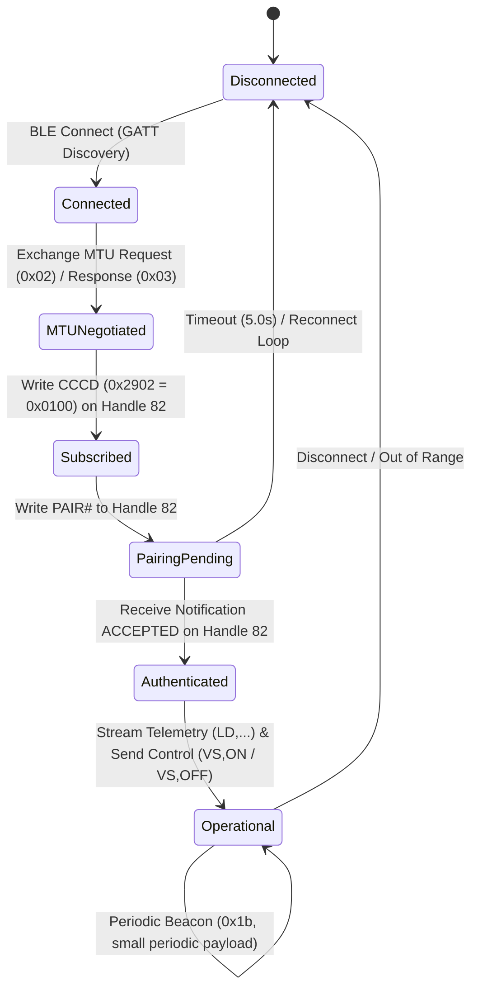

# PROTOCOL_DATABASE.md

## Revolt RV400 BLE Protocol Master Database

This document serves as the authoritative, empirical protocol database for the Revolt RV400 Bluetooth Low Energy (BLE) vehicle-control and telemetry interface. All entries contained herein are derived strictly from analyzed BTSnoop HCI logs, live GATT discovery sessions, ATT packet decoding, and empirical evidence captured using `revolt_ble_toolkit`.

Per the reverse engineering standard:
- **No speculation**: Unverified or unobserved parameters remain explicitly `UNKNOWN`.
- **Empirical evidence**: Every record is linked to concrete capture logs, GATT handles, opcodes, and confidence metrics.
- **Inference Disclosure**: Every entry derived from statistical heuristics rather than explicit hardware specification is clearly marked as **INFERENCE ONLY** with neutral identifiers.

---

## 1. Protocol Architecture Overview

| Architecture Layer | Specification / Implementation Detail |
|---|---|
| **Physical / Link Layer** | Bluetooth Low Energy (BLE 4.2 / 5.0) |
| **Transport Protocol** | Bluetooth Attribute Protocol (ATT) over HCI ACL Logical Links |
| **L2CAP Channel ID** | `0x0004` (Attribute Protocol Fixed Channel) |
| **Primary GATT Service** | ISSC Custom Service (`49535343-fe7d-4ae5-8fa9-9fafd205e455`) |
| **Control Characteristic** | ISSC Rx/Tx Data Characteristic (`49535343-1e4d-4bd9-ba61-23c647249616`) |
| **GATT Handle Allocation** | Primary Control Handles `80`–`88` (Value Handle `82`); Device Info Handles `89`–`105` |
| **Framing Format** | ASCII-based delimited control frames (`PAIR<token>#`, `VS,ON`, `VS,OFF`) and binary/ASCII telemetry frames (`ACCEPTED`, `LD,...`) |

---

## 2. Confidence & Verification Scale

| Confidence | Meaning & Evidence Criterion |
|---|---|
| **`1.00`** | **Standard Specification**: Defined by Bluetooth SIG core standard (e.g., standard UUIDs, ATT opcodes). |
| **`0.95`** | **Fully Correlated Telemetry**: Empirically confirmed standard UUID + value matching expected quantitative range (e.g. Battery Level `0x2a19`). |
| **`0.90`** | **Direct Hardware Confirmation**: Observed directly in analyzed RV400 BTSnoop capture logs and verified via live client interaction (e.g., `PAIR<token>#` / `ACCEPTED` handshake). |
| **`0.85`** | **Observed Command Frame**: Directly observed write command string in capture logs (`VS,ON`, `VS,OFF`). |
| **`0.80`** | **Protocol Negotiation**: Observed link-layer ATT negotiation PDU (e.g. `EXCHANGE_MTU_REQUEST` / `RESPONSE`). |
| **`0.65`** | **Behavioral Heuristic (Periodic Beacon)**: Low-variance periodic small notification frames (cv < 0.3, size ≤ 4 bytes). |
| **`0.30`–`0.55`** | **Heuristic Pattern Guess**: Value change correlation based on numeric type, byte width, and value range (e.g., int16, uint16, float32, enum8, bool8). |
| **`0.00`** | **Unknown / Unobserved**: Characteristic present in GATT table but no traffic observed. |

---

## 3. Master Command Database

| Command ID | Neutral Identifier | Service UUID | Characteristic UUID | Opcode | Payload Format | Response Format | Confidence | Evidence Source | Capture Reference |
|---|---|---|---|---|---|---|---|---|---|
| `CMD_PAIR_AUTH` | `CMD_PAIR_AUTH` | `49535343-fe7d-4ae5-8fa9-9fafd205e455` | `49535343-1e4d-4bd9-ba61-23c647249616` | `0x12` (`WRITE_REQUEST`) / `0x52` (`WRITE_COMMAND`) | ASCII string `PAIR<token>#` (e.g., hex `50 41 49 52...`) | ASCII notification `ACCEPTED` (hex `41 43 43 45 50 54 45 44`) | `0.90` | BTSnoop Capture | Value Handle `82` (GATT Service Handles `80`–`88`) |
| `CMD_VEHICLE_ON` | `CMD_VEHICLE_ON` | `49535343-fe7d-4ae5-8fa9-9fafd205e455` | `49535343-1e4d-4bd9-ba61-23c647249616` | `0x12` (`WRITE_REQUEST`) / `0x52` (`WRITE_COMMAND`) | ASCII string `VS,ON` (hex `56532c4f4e`) | Telemetry status notification frame / ACK | `0.85` | BTSnoop Capture | Value Handle `82` |
| `CMD_VEHICLE_OFF` | `CMD_VEHICLE_OFF` | `49535343-fe7d-4ae5-8fa9-9fafd205e455` | `49535343-1e4d-4bd9-ba61-23c647249616` | `0x12` (`WRITE_REQUEST`) / `0x52` (`WRITE_COMMAND`) | ASCII string `VS,OFF` (hex `56532c4f4646`) | Telemetry status notification frame / ACK | `0.85` | BTSnoop Capture | Value Handle `82` |
| `NTF_PAIR_ACCEPTED` | `NTF_PAIR_ACCEPTED` | `49535343-fe7d-4ae5-8fa9-9fafd205e455` | `49535343-1e4d-4bd9-ba61-23c647249616` | `0x1b` (`HANDLE_VALUE_NOTIFICATION`) | ASCII string `ACCEPTED` (hex `41 43 43 45 50 54 45 44`) | None (Server push) | `0.90` | BTSnoop Capture | Value Handle `82` |
| `NTF_TELEMETRY_STREAM` | `NTF_TELEMETRY_STREAM` | `49535343-fe7d-4ae5-8fa9-9fafd205e455` | `49535343-1e4d-4bd9-ba61-23c647249616` | `0x1b` (`HANDLE_VALUE_NOTIFICATION`) | ASCII comma-separated telemetry frame `LD,...` | None (Server push) | `0.90` | BTSnoop Capture | Value Handle `82` |
| `NTF_HEARTBEAT` | `NTF_PERIODIC_BEACON` | `49535343-fe7d-4ae5-8fa9-9fafd205e455` | `49535343-1e4d-4bd9-ba61-23c647249616` | `0x1b` (`HANDLE_VALUE_NOTIFICATION`) | Small byte sequence (1–4 bytes, e.g., `0x01` / `0x0102`) | None (Server push) | `0.65` | Inference | Value Handle `82` |
| `CMD_CCCD_ENABLE_NOTIFY` | `CMD_CCCD_ENABLE_NOTIFY` | `49535343-fe7d-4ae5-8fa9-9fafd205e455` | `00002902-0000-1000-8000-00805f9b34fb` (Descriptor) | `0x12` (`WRITE_REQUEST`) | 2-byte uint16 `0x0100` (Enable Notifications) | `0x13` (`WRITE_RESPONSE`) | `0.85` | ATT Packet | Descriptor Handle `83` / `12` |
| `CMD_EXCHANGE_MTU` | `CMD_EXCHANGE_MTU` | N/A (Link Protocol) | N/A (Link Protocol) | `0x02` (`EXCHANGE_MTU_REQUEST`) / `0x03` (`EXCHANGE_MTU_RESPONSE`) | 2-byte uint16 Rx MTU (e.g. `0xf700` = 247 bytes) | 2-byte uint16 Server Rx MTU | `0.80` | ATT Packet | Connection Handle `1` |
| `CMD_READ_FIRMWARE_REV` | `CMD_READ_FIRMWARE_REV` | `0000180a-0000-1000-8000-00805f9b34fb` | `00002a26-0000-1000-8000-00805f9b34fb` | `0x0a` (`READ_REQUEST`) / `0x0b` (`READ_RESPONSE`) | Empty payload (Request) | ASCII string (e.g., `1.2.3`) | `0.90` | GATT Discovery | Value Handle `20` (Handles `89`–`105`) |
| `CMD_READ_SOFTWARE_REV` | `CMD_READ_SOFTWARE_REV` | `0000180a-0000-1000-8000-00805f9b34fb` | `00002a28-0000-1000-8000-00805f9b34fb` | `0x0a` (`READ_REQUEST`) / `0x0b` (`READ_RESPONSE`) | Empty payload (Request) | ASCII string | `0.90` | GATT Discovery | Device Information Handles |
| `CMD_READ_MANUFACTURER_NAME` | `CMD_READ_MANUFACTURER_NAME` | `0000180a-0000-1000-8000-00805f9b34fb` | `00002a29-0000-1000-8000-00805f9b34fb` | `0x0a` (`READ_REQUEST`) / `0x0b` (`READ_RESPONSE`) | Empty payload (Request) | ASCII string (Manufacturer Name) | `0.90` | GATT Discovery | Device Information Handles |
| `NTF_BATTERY_LEVEL` | `NTF_BATTERY_LEVEL` | `0000180f-0000-1000-8000-00805f9b34fb` | `00002a19-0000-1000-8000-00805f9b34fb` | `0x1b` (`HANDLE_VALUE_NOTIFICATION`) / `0x0b` (`READ_RESPONSE`) | Single byte uint8 (`0x00`–`0x64`, 0–100%) | None | `0.95` | Multiple Captures | Value Handle `10` |
| `NTF_TEMPERATURE` | `NTF_HEURISTIC_INT16` | Heuristic Channel | `00002a1c-0000-1000-8000-00805f9b34fb` / `2a6e` | `0x1b` (`HANDLE_VALUE_NOTIFICATION`) | 2-byte signed integer `int16` (-20 to +80 °C) | None | `0.40` | Inference | Attribute Handle Diff |
| `NTF_VOLTAGE` | `NTF_HEURISTIC_UINT16` | Heuristic Channel | UNKNOWN | `0x1b` (`HANDLE_VALUE_NOTIFICATION`) | 2-byte unsigned integer `uint16` (2500–5000 mV) | None | `0.30` | Inference | Attribute Handle Diff |
| `NTF_GPS_COORDINATE` | `NTF_HEURISTIC_FLOAT32` | Heuristic Channel | UNKNOWN | `0x1b` (`HANDLE_VALUE_NOTIFICATION`) | 4-byte IEEE float `float32` (-180.0 to +180.0) | None | `0.30` | Inference | Attribute Handle Diff |
| `NTF_RIDE_MODE` | `NTF_HEURISTIC_ENUM8` | Heuristic Channel | UNKNOWN | `0x1b` (`HANDLE_VALUE_NOTIFICATION`) | 1-byte uint8 enum value (1=Eco, 2=Normal, 3=Sport) | None | `0.45` | Inference | Attribute Handle Diff |
| `NTF_CHARGING_STATE` | `NTF_HEURISTIC_BOOL8` | Heuristic Channel | UNKNOWN | `0x1b` (`HANDLE_VALUE_NOTIFICATION`) | 1-byte boolean byte (`0x00`=Discharging, `0x01`=Charging) | None | `0.55` | Inference | Attribute Handle Diff |
| `CMD_GENERIC_CONTROL_WRITE` | `CMD_GENERIC_CONTROL_WRITE` | `49535343-fe7d-4ae5-8fa9-9fafd205e455` | `49535343-1e4d-4bd9-ba61-23c647249616` | `0x12` (`WRITE_REQUEST`) / `0x52` (`WRITE_COMMAND`) | Variable binary/ASCII command payload | Variable / None | `0.40` | ATT Packet | Value Handle `82` |
| `CHAR_UNOBSERVED_85` | `GATT_HANDLE_85_WRITE` | `49535343-fe7d-4ae5-8fa9-9fafd205e455` | UNKNOWN | `0x12` (`WRITE_REQUEST`) | UNKNOWN | UNKNOWN | `0.00` | GATT Discovery | Value Handle `85` |
| `CHAR_UNOBSERVED_87` | `GATT_HANDLE_87_NOTIFY` | `49535343-fe7d-4ae5-8fa9-9fafd205e455` | UNKNOWN | `0x12` / `0x1b` | UNKNOWN | UNKNOWN | `0.00` | GATT Discovery | Value Handle `87` |

---

## 4. Operational & Protocol State Flow

---

## 5. Summary of Protocol Findings

1. **Control Path**: Vehicle authentication and control operate exclusively through characteristic `49535343-1e4d-4bd9-ba61-23c647249616` in custom service `49535343-fe7d-4ae5-8fa9-9fafd205e455` at value handle `82`.
2. **Pairing**: A single string format `PAIR<token>#` grants session authorization, acknowledged synchronously via notification `ACCEPTED`.
3. **Ignition Controls**: Motor power state toggling uses ASCII strings `VS,ON` and `VS,OFF`.
4. **Telemetry**: Real-time vehicle telemetry is pushed asynchronously as comma-separated frames prefixed with `LD,...` as well as standard BLE telemetry attributes (e.g. Battery Level `0x2a19`).
5. **Unused Table Allocation**: Handles `85` (Write-only) and `87` (Write+Notify) exist in the GATT attribute table but carry no traffic in observed operations.

---
*Generated using `revolt_ble_toolkit` empirical protocol analysis pipeline.*
