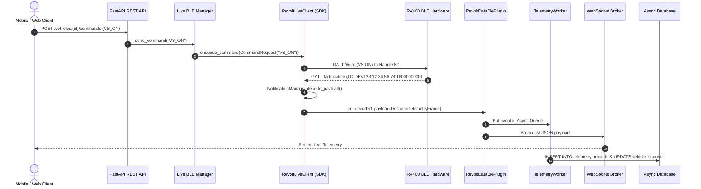

# SYSTEM_ARCHITECTURE.md

## `revolt_data` System Architecture & Integration Specification

`revolt_data` is an enterprise-grade FastAPI backend service and real-time data engine for the Revolt RV400 electric vehicle platform. It relies on `revolt_ble_toolkit` as its core internal BLE dependency for physical hardware communication, packet parsing, and decoded payload streaming.

---

## 1. High-Level Architecture Overview

```mermaid
graph TD
    ClientApp[Mobile / Web Client] -->|REST APIs (HTTP/2)| FastAPIRouter[FastAPI API Layer]
    ClientApp -->|WebSocket (JSON)| WSBroker[WebSocket Broker]
    
    FastAPIRouter --> AuthSvc[Authentication Service]
    FastAPIRouter --> VehicleSvc[Vehicle Service]
    FastAPIRouter --> CommandSvc[Command Router]
    
    CommandSvc --> LiveBLEMgr[Live BLE Manager (Singleton)]
    
    subgraph Revolt BLE Toolkit SDK Internal Dependency
        LiveBLEMgr --> ToolkitClient[RevoltLiveClient]
        ToolkitClient --> StateMachine[ConnectionStateMachine]
        ToolkitClient --> WriteQueue[AsyncWriteQueue]
        ToolkitClient --> NotificationMgr[NotificationManager]
        ToolkitClient --> HeartbeatMgr[HeartbeatManager]
    end
    
    NotificationMgr -->|Decoded Models| DataPlugin[RevoltDataBlePlugin]
    StateMachine -->|State Events| DataPlugin
    
    DataPlugin -->|Async Event Queue| TelemetryWorker[Background Telemetry Worker]
    DataPlugin -->|Realtime Events| WSBroker
    
    TelemetryWorker --> TripSvc[Trip Analytics Service]
    TelemetryWorker --> AsyncDB[(Async SQLite / PostgreSQL DB)]
```

---

## 2. Core Architectural Principles

1. **Zero Duplicate BLE Parsing**: All ATT/GATT packet decoding, framing checks, opcode parsing, and byte-level payload conversions are delegated exclusively to `revolt_ble_toolkit.live`.
2. **Decoded Event-Driven Pipeline**: The backend subscribes to strongly typed Python model objects (`DecodedTelemetryFrame`, `DecodedBatteryStatus`, `DecodedPairingResponse`, `ConnectionStateEvent`) emitted via `RevoltDataBlePlugin`.
3. **Async Non-Blocking Execution**: High-concurrency `asyncio` architecture across FastAPI endpoints, database sessions, write queues, and background workers.
4. **Decoupled Persistence & Real-time Delivery**: Decoded events are concurrently streamed to connected WebSocket clients and buffered in an async background queue for database insertion.

---

## 3. Component Hierarchy & Responsibilities

| Component | Module Path | Primary Responsibility |
|---|---|---|
| **FastAPI Core Application** | `revolt_data.main` | App factory, lifespan management, CORS middleware, CORS headers, API router registration. |
| **Configuration Engine** | `revolt_data.config` | Layered environment configurations, database URLs, token expiration, heartbeat thresholds. |
| **Async Database Engine** | `revolt_data.database` | Async SQLAlchemy engine, session maker, Declarative Base, connection pool management. |
| **Authentication Service** | `revolt_data.services.auth_service` | Password hashing (SHA-256), JWT access token generation, token verification, route dependencies. |
| **Live BLE Manager** | `revolt_data.services.ble_manager` | Singleton manager orchestrating `RevoltLiveClient` instances, auto-connect loops, and command dispatching. |
| **Revolt BLE Toolkit Plugin** | `revolt_data.plugins.toolkit_plugin` | Custom `BlePlugin` implementation bridging `revolt_ble_toolkit.live` lifecycle hooks to `revolt_data`. |
| **Background Telemetry Worker** | `revolt_data.workers.telemetry_worker` | Async background worker persisting decoded telemetry time-series, updating vehicle status, and detecting trip boundaries. |
| **Trip Analytics Service** | `revolt_data.services.trip_service` | Ride history tracking, Haversine distance calculation, speed metrics, battery consumption analytics. |
| **WebSocket Broker** | `revolt_data.api.websocket` | Async connection broker managing real-time telemetry streaming over persistent WebSocket connections. |

---

## 4. End-to-End Event Sequence Flow



---

## 5. Security & Isolation Architecture

- **Token-Based Authorization**: Every protected API route requires a valid HTTP `Bearer` JWT token.
- **Resource Ownership Scoping**: Vehicle, trip, and telemetry queries enforce strict SQL `WHERE owner_id = :current_user_id` filtering.
- **Hardware Credential Isolation**: Vehicle BLE pairing tokens and MAC addresses are stored securely and never exposed over public endpoints.

---
*Generated for `revolt_data` FastAPI Backend Service.*
